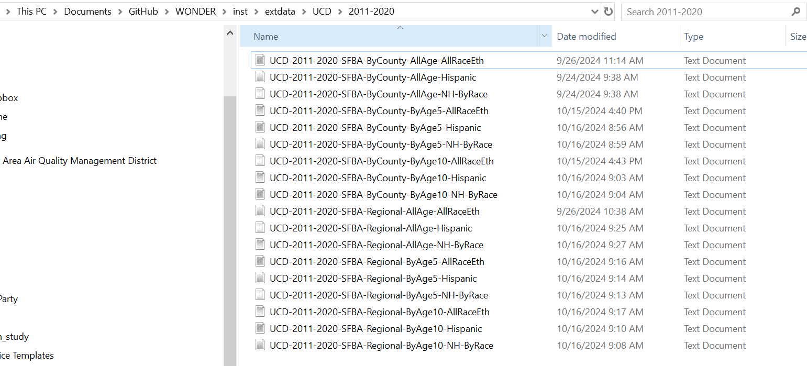

# Where to request data

You should go to this weblink to request data <https://wonder.cdc.gov/ucd-icd10.html>

Click "I Agree" on the webpage so that you can move to request form and start to request data

# Request AllAge Mortality Data

## County-level

### AllRaceEth Mortality Data

-   Choose Group results by "County"

-   Select crude data as well as Age Adjusted Rate with 95% CI intervals

-   Choose the 9 counties in the Bay Area

-   Choose all ages, genders, races/ethnicities

-   Choose years of interests

-   Choose all mortality causes

-   Determine how to export data

-   Click "Send" to request data, rename file for further processing

](images/clipboard-3630398401.png)

### Hispanic All-race Mortality Data

-   Choose Group results by "County" and by "Hispanic Origin"

-   Select crude data as well as Age Adjusted Rate with 95% CI intervals

-   Choose the 9 counties in the Bay Area

-   Choose all Ages, Genders, Hispanic or Latino Origin and All Races

-   Choose years of interests

-   Choose all mortality causes

-   Determine how to export data

-   Click "Send" to request data, rename file for further processing

## 

### Non-Hispanic Race-specific Mortality Data

-   Choose Group results by "County" and by "Hispanic Origin" and by "Race"

-   Select crude data as well as Age Adjusted Rate with 95% CI intervals

-   Choose the 9 counties in the Bay Area

-   Choose all ages, genders, Non-Hispanic or Latino Origin and four specific races

-   Choose years of interests

-   Choose all mortality causes

-   Determine how to export data

-   Click "Send" to request data, rename file for further processing

## Regional-level

Basically follows the above instructions, except to use Group results by "State" rather than "County"

# Request Mortality Data by Age Groups

Basically follows the above instructions, except to choose Group results by "Ten-year Age Groups" or by "Five-Year Age Groups" in Section 1 of this request form, and select the Age groups of interests in Section 3 of this request form (see example screenshots below)

# File Naming Convention

Please see the screenshot below for the filenames used.

